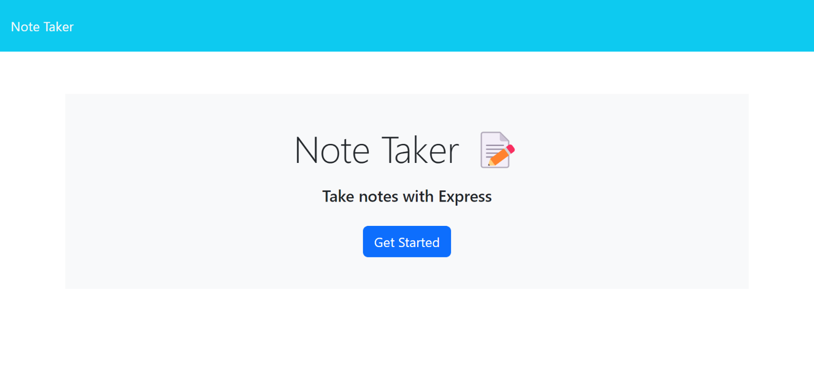

# Notepad App
 
    

 ## Description
  Note taker application that can be used to write, save, and delete notes. This app will use an Express.js back end and will save and retreive note data from a JSON file.

 
 ## Table of Contents
   * [Description](#description)
   * [Visuals](#visuals)  
   * [Installation](#installation)
   * [Usage](#usage)
   * [License](#license)
   * [Contribution](#contribution)
   * [Tests](#tests)
   * [Questions](#questions)
 
 
 ## Visuals
 #### Click on the image below to reveal a video demonstration:

 
 
 
 ## Installation
 #### To install the given application:
  * No need to install - [Click Here](https://notepad-app-2023-e86abd3d58b8.herokuapp.com/) to use the app!
   
 
 ## Usage
 #### How to use the application:
  * [Open](https://notepad-app-2023-e86abd3d58b8.herokuapp.com/) app in Web-browser to view homepage.
  * Click the button -  `Get Started` - to begin.
  * This page allows the user view, input, save, and delete notes.  
  * To ADD a new note, enter the note title and list in the textbox provided, then save it by clicking the - `Save Icon` - in the top right corner.  
  * The saved note will appear in the left-hand column with ther other existing notes. 
  * When an existing note is selected from the list, then it will appear on the screen.
  * To clear out the text input field on the screen, select the - `Plus Icon` - in the top right corner. 
  * To DELETE a note from the list, select the - `Red Trash Icon` - next to the note.  

 
 ## License
   This project is covered under the following license: 
 
 ## Contribution
   One can contribute by cloning the repo from the github page, adding a new branch, and pushing changes to the main branch. 
 
 ## Tests
   Testing can be done by using a RESTful api/server side app like POSTMAN or INSMONIA to debug and test all CRUD commands. 
 
 ## Questions
   If you have any questions, please email me at: knickler3@gmail.com  
   My GitHub page is: [kwaters3](https://github.com/kwaters3)
   
